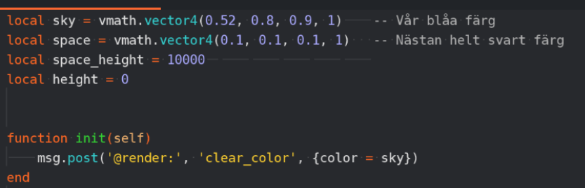
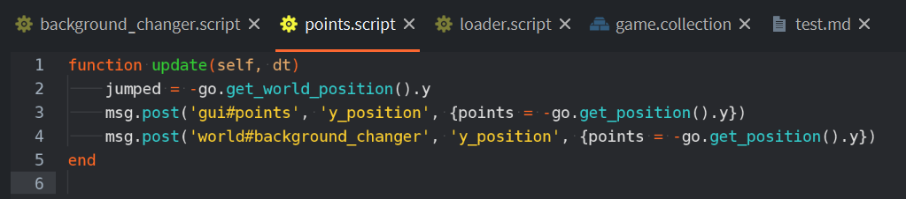
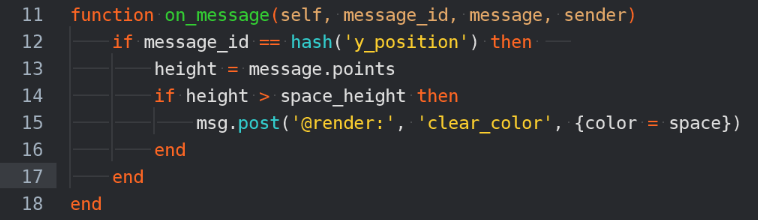
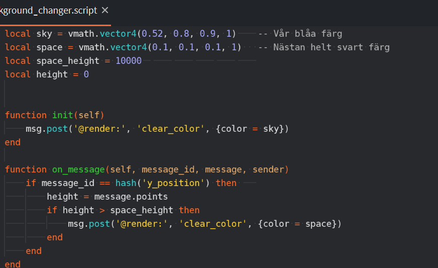

# Ändra färg när du når rymden (del1)

## RGB och Message passing

#### Förkunskaper: Defold 1-3. GUI

När vi når 10 000 poäng eller så är vi ju väldigt högt uppe! Vi är kanske då i RYMDEN! Då får vi se till att byta bakgrunden så den inte längre är blå. Någon form av svart färg passar bättre.

<table><tbody><tr class="odd"><td>
<strong>Lite kort om färger och RGB/A</strong>

Man blandar olika mängder av basfärgerna röd, grön, blå för att få fram alla andra färger. Skalan går från 0-1 ibland (0-255).

Man har ibland också ha ett alpha värde mellan 0-1 som säger hur genomskinligt färgen ska vara. 0 är helt genomskinlig och 1 är helt ogenomskinlig.

Om man har inga färger (0,0,0) blir det svart.

Om man har alla färger (1,1,1) blir det vitt.
</td></tr></tbody></table>

(0.52, 0.8, 0.9) är den blåa färg vi har nu.

 Var bestäms den?

-   Just nu görs det i `loader.script` i **init()**

    >`msg.post('@render:', 'clear_color', {color = vmath.vector4(0.52, 0.8, 0.9, 1)})`
    - Klipp bort den raden. (CTRL-X)
    - 

        

        Bygg och se vad som händer.
        

        Det blir svart. (Vi har ingen bakgrund färg), vi ska fixa detta senare.
        

    

### background_changer.script
Vi ska nu skapa ett skript som ändrar färgerna på bakgrunden baserad på hur långt upp vi har hoppat. Vi vill att skriptet ska göra lite saker:

1.  Den ska göra att bakgrunden är vår grundfärg (blå) när vi startar spelet

2.  Den ska göra att bakgrundsfärgen byts till en annan färg (typ svart) när vi når en viss hopphöjd (10 000).
    -   Skriptet måste därför också ta emot meddelande som säger hur högt vi har hoppat.

    

    Skapa background_changer.script
    

Skapa ett ett skript, `background_changer.script` så att det ligger så här:

> /gui/background_changer.script
-   Lägg till skriptet till **game.collection** som **Component File** under spelobjektet **/world**

    -  ID: background_changer

-   Öppna nu `background_changer.script`.

    1.  Ta bort de autogenererade funktionerna (behåll **init()** och **on_message()** om du vill)

    2.  börja med att deklarera variablerna sky, space, space_height, height och t.

        -   `sky` - en vektor som beskriver vår blåa färg

        -   `space` - en vektor som beskriver vår svarta färg

        -   `space_height` - Hur långt vi ska ha hoppat för att nå rymden (låt det vara en låg siffra, typ 100, medan man testar och ändra det till det man vill senare)

        -   `height` - hur långt vi har hoppat
    3.  Ändra bakgrunden till vår grundfärg, blå, när spelet startas. Det ska bara göras varje gång spelet startas om.
        

        
Var bör vi skriva det då?

        Görs i init()

        >`msg.post('@render:', 'clear_color', {color = sky})`
        
        Testa att färgen blir blå när du startar spelet.
        

Resultat:

## Message Passing
Vi ska ta emot meddelanden om hur högt vi har hoppat, precis som vi gjorde med poäng GUI:n i Meetup 3. 

Varje brev har en avsändare och en mottagare. **Mottagaren** är *background_changer.script*. Vem skulle kunna vara **avsändaren**? 

Vilket skript är avsändare till meddelanden om **hur långt vi hoppat?** Vi vill ju ha samma information för vårt `background_changer.script`.

    
 
    Svar
    

Avsändaren är:

>`points.script`

Öppna points.script och skicka ett meddelande med höjden av spelobjektet (världen) till `background_changer.script`.

> `msg.post('world\#background_changer', 'y_position', {points = -go.get_position().y})`

### Ta emot meddelande

Gå nu tillbaka till `background_changer.script`. Vi ska skriva klart den.

Vi ska nu bestämma vad som händer när vi tar emot meddelandet. 

Vilken inbyggd funktion bör vi använda för att hantera vad som händer när vi tar emot meddelanden?

>`on_message(self, message_id, message, sender)`

Vi vill nu bestämma vilket meddelanden vi tagit emot, vi ska se till att det är den markerad med ‘y_position’.

>`message_id == hash('y_position')`

Om meddelandet har rätt `message_id` så ska vi spara meddelandets innehåll (`message`) i vår height variabel. (Kom ihåg att poängen är hur högt vi har hoppat från meetup 3)

> `height = message.points`

Om höjden vi har hoppat överstiger en viss höjd så ska vi ändra bakgrundsfärgen. Hur gör vi det?

med if-sats och msg.post. Se bild

Testa att allt funkar, om inte se slutresultat bilden längre ner.

Slutresultat

