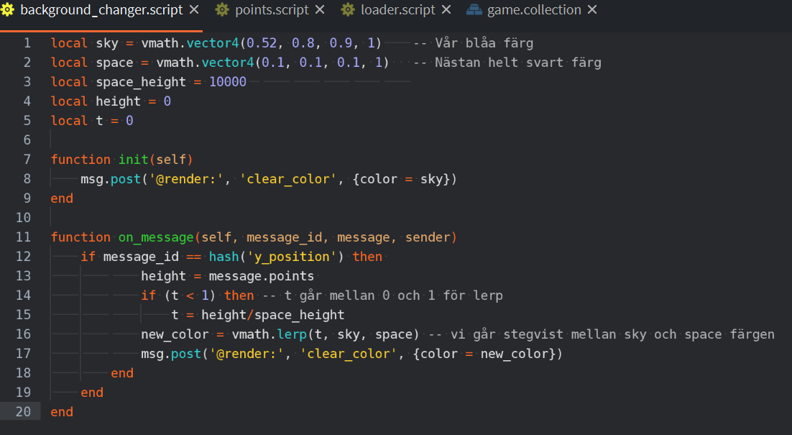

# Gradvist ändra färg när du hoppar (del2)

### Med linjär interpolation

#### Förkunskaper: Defold 1-3, Ändra färg när du når rymden (del1)

Det är ju lite konstigt att världen går från blå till svart på ett ögonblick. Vi ska nu gå igenom ett sätt att gradvist ändra färgen på bakgrunden baserad på hur långt vi har hoppat. Vi ska använda oss av **linjär interpolation** (ofta kallad lerp) som är en metod för att med jämna steg gå från ett värde till ett annat. I vårt fall ska vi gå från en vektor till en annan vektor:

>   `sky = vmath.vector4(0.52, 0.8, 0.9, 1)` 

   -- Från detta 

>   `space = vmath.vector4(0.1, 0.1, 0.1, 1)` 

 -- Till detta

I Lua kan man använda sig av [**<u>lerp </u>**](https://defold.com/ref/vmath/#vmath.lerp:t-v1-v2)för att linjärt interpolera som är del av *vmath* biblioteket.

-   vmath.lerp(t, v1, v2) som returnerar en resulterande vektor v

    -   t: är interpolations parameter (mellan 0 och 1)

    -   v1: startvektor

    -   v2: slutvektor

    -   v: resulterade vektor

Exempel 1:

-   om t = 0 så blir resulterande vektor v1

-   om t = 1 så blir resulterade vektor v2

-   om t = 0.5 så får vi en resulterande vektor som är halvvägs emellan.

Exempel 2, med färger:

-   v1 = (1,1,1,1), vitt

-   v2 = (0,0,0,1), svart

    -   Om t = 0 så blir resulterande färg vitt

    -   Om t = 1 så blir resulterande färg svart

    -   om t = 0.5 så blir resulterande färg grått, v =  (0.5, 0.5, 0.5, 1)

Börja med att deklarera t
> `local t = 0`

Vi vill att t ska gå från 0 till 1, samtidigt som höjden går från 0 till 10 000 (eller något annat värde). 

-   *t = height/space_heigh*t, beskriver detta. När vi har 10 000 poäng, så är height samma värde dvs. t = 1, då 10 000/10 000 = 1

-   *height* kan ju bli större än 10 000 om man är duktig som spelare. Så vi får ha en if-sats som ser till att vi ändrar på färgen bara så länge t \<= 1

Vi kan nu skriva vår lerp funktion:

>`new_color = vmath.lerp(t, sky, space)` 

Vi går stegvist mellan sky och space färgen

Låt `new_color` vara en färg mellan som är något mellan blåa himmeln och svarta rymden. Ju högre vi hoppat ju mer likt svarta rymden än blå himmeln.

Vi renderar nu ut den nya färgen varje gång. 

Genom att byta ut vektorn som beskriver blåa färgen med vår variabel new_color som har en färg som ändras beroende på höjden vi hoppat. 

> `msg.post('@render:', 'clear_color', {color = new_color})`

Testa att allt funkar, se annars bilden nedan.

Slutresultat bild och kod:

`background_changer.script`

    local sky = vmath.vector4(0.52, 0.8, 0.9, 1)	-- Vår blåa färg
    local space = vmath.vector4(0.1, 0.1, 0.1, 1)   -- Nästan helt svart färg
    local space_height = 10000						
    local height = 0
    local t = 0

    function init(self)
        msg.post('@render:', 'clear_color', {color = sky})
    end

    function on_message(self, message_id, message, sender)
        if message_id == hash('y_position') then 
                height = message.points 
                if (t < 1) then -- t går mellan 0 och 1 för lerp
                    t = height/space_height
                new_color = vmath.lerp(t, sky, space) -- vi går stegvist mellan sky och space färgen
                msg.post('@render:', 'clear_color', {color = new_color})
            end
        end
    end

