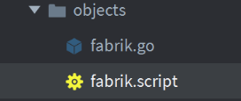
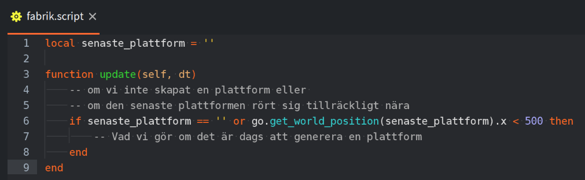

### Skapa fabriken och dess script i objects

### Skapa en factory-komponent och sätt på scriptet

Skapa komponenten i fabrik.go: Game Object

Sätt dess id till plattform

Sätt dess Prototype till plattformsobjektet

Sätt på scriptet på fabriken

### 

### Skriv scriptet för hur plattformarna ska genereras

Definiera variabel för den senaste plattformen och när vi ska generera nya i update

Skriv koden för hur vi genererar nya

Här kan man justera math.random för att bestämma hur de kan placeras
