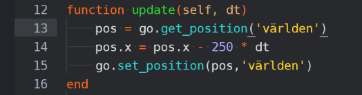
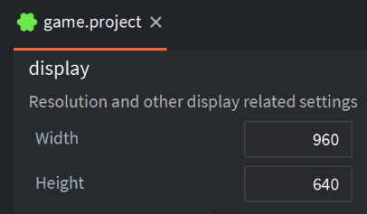
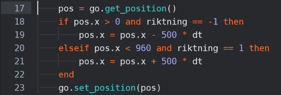
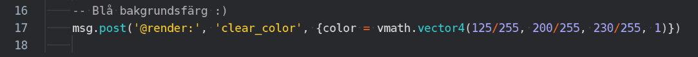

### Få världen att röra på sig automatiskt

### Kunna springa runt i världen när den rör på sig

Ta reda på var skärmens kanter går genom att titta i game.project

Uppdatera sedan spelare.script så att den endast rör sig inom skärmens gränser, i update()

### Ändra bakgrundsfärg

Ändra siffrorna som delas med 255 på rad 17 i loader.script

