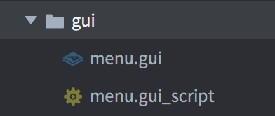
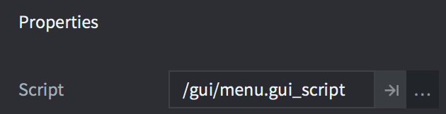
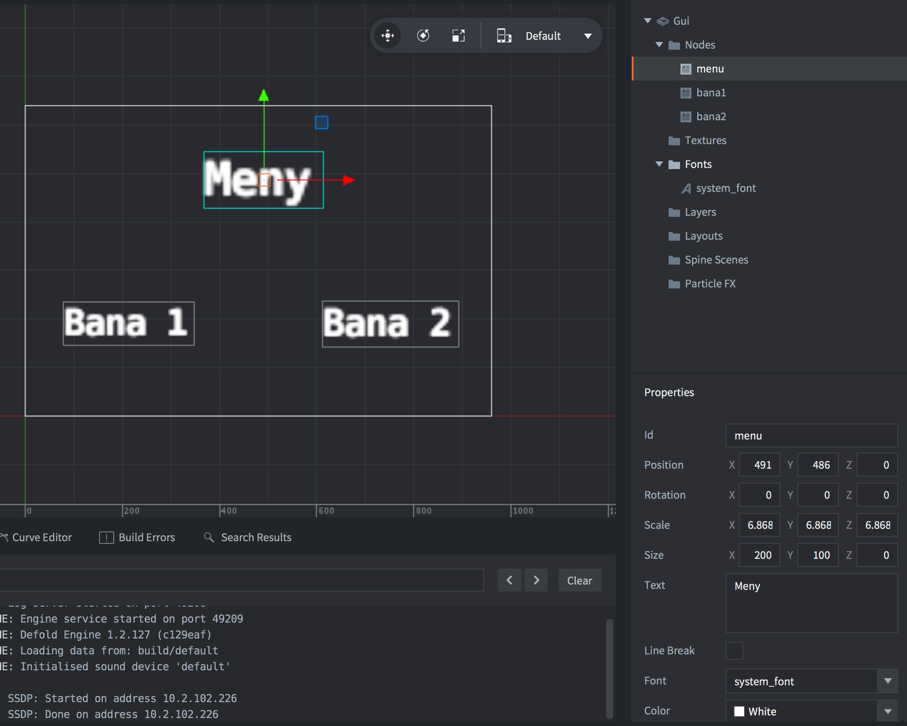
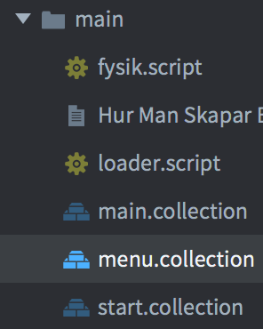
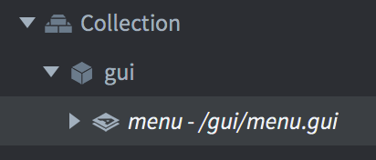
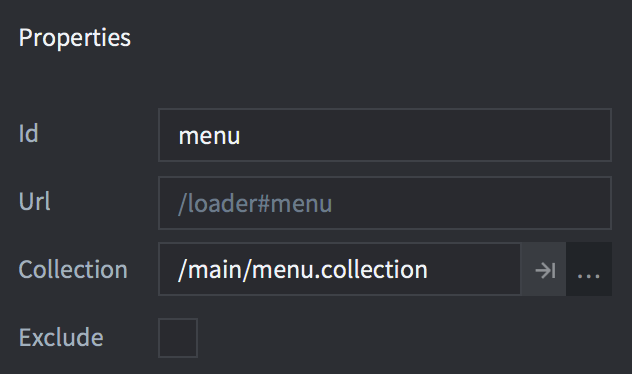
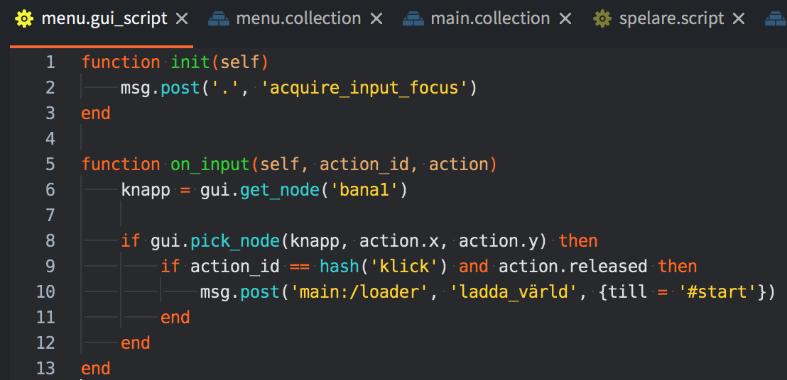

## GUI

**1.** Skapa en ny mapp som heter **gui**. I denna, skapa ett gui och ett tillhörande guiskript. Välj ett namn som passar, här används *menu*.

**2.** I *menu.gui*, lägg in *menu.gui_script* som script i Properties i Outline.

**3.** I *menu.gui*, högerklicka på **Fonts** och lägg till den font du vill ha. Högerklicka sedan på **Node** och lägg till en textnod för varje textsnutt du vill ska synas på skärmen. För vardera textnod, sätt **id** till ett lämpligt id, skriv texten i **Text** och välj fonten du vill ha som **Font**.

**4.** Lägg till en ny collection i main-mappen och döp den till samma sak som ditt gui, här *menu.collection*.

**5.** I *menu.collection***,** lägg till ett **game object** och kalla det för *gui*. Add component file *menu.gui*.

**6.** Gå sedan till main.collection, högerklicka på *loader* och lägg till en **collection proxy**. Sätt id till samma namn som ditt gui och välj din gui-collection som collection.

**7.** På lämpligt ställe i din kod skriver du sedan följande för att guit ska laddas på skärmen:

**msg.post('main:/loader', 'ladda_värld', { till = '\#menu'})**

**8.** För att kunna klicka på textnoder och komma till andra delar av spelet, skriv följande kod i guits skript, men ändra de gula strängarna på rad 6, 9 och 10 så att det passar ditt spel.

