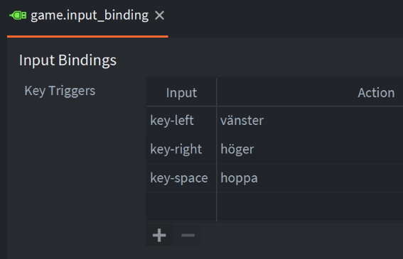
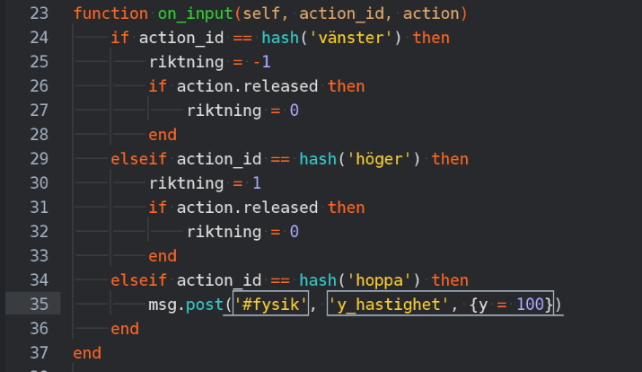
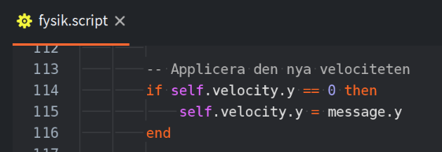

### Lägg till en knapp för att hoppa och dess action-namn

### Uppdatera spelare.script (bara sista tre raderna av update är nya)

Ni kan ändra 100 till vad ni vill

### Om ni bara vill att man ska kunna hoppa på marken 

ändra i fysik.script där hoppet utförs och kolla att man inte är på väg upp eller ner (rad 113)

