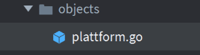
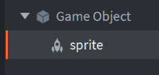
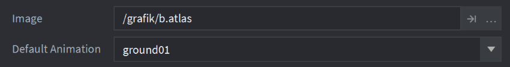
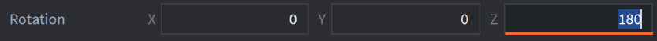
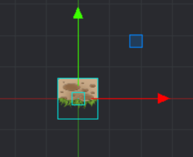
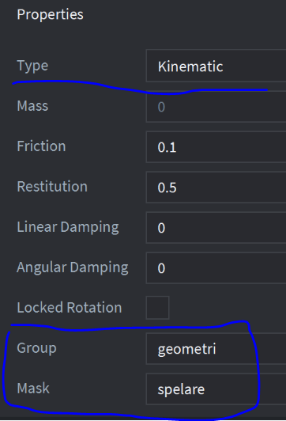
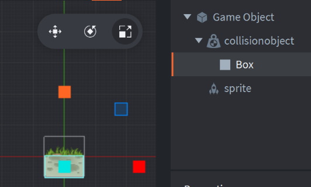
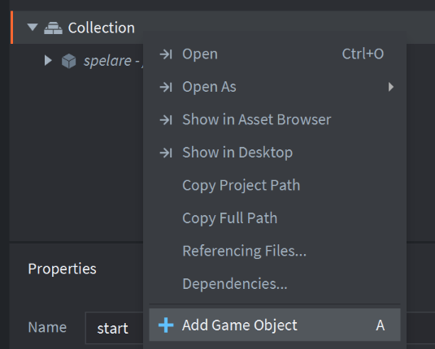
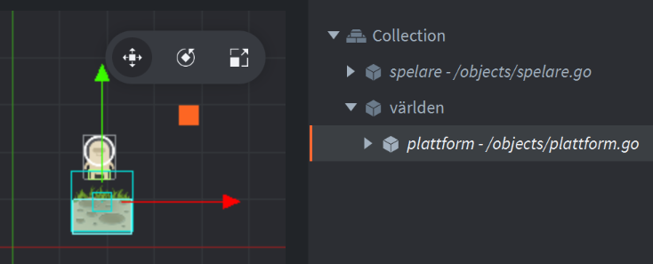

### 

### Skapa plattformsobjektet med sprite

1\. Skapa ett gameobject plattform.go i objects

2\. Skapa en sprite och sätt dess Image och Default 

Animation i properties enl. bilden nedan

Spriten är uppochned så sätt dess rotation runt z-axeln till 180 (grader) i dess properties  
  
  
  

### Lägg till ett collisionobject

Sätt Type till kinematic  
  
Group: **geometri** (viktigt: bestäms av spelarens fysik.script)

Mask: spelare

Lägg till en box-shape och placera boxen på spriten

### Skapa världen i start.collection

I start.collection högerklicka på Collection och Add Game Object, sätt id till världen, lägg in din plattform i världen
