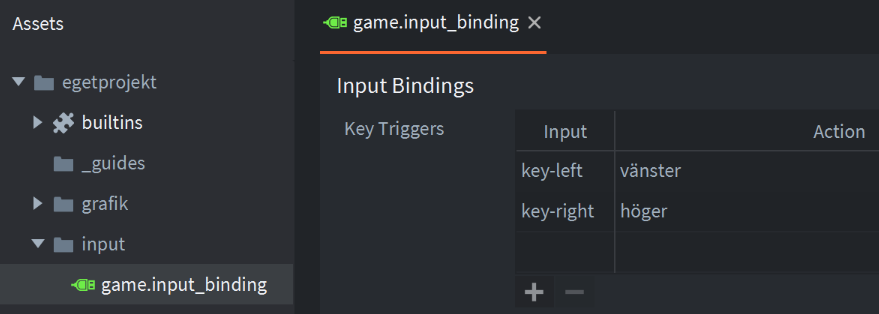
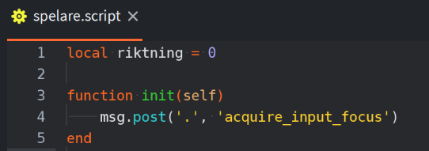
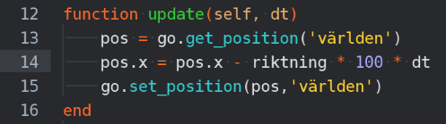
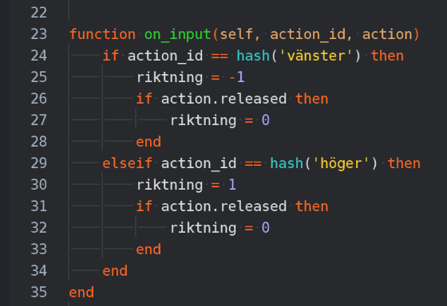

### Lägg in keybindings för ‘vänster’ och ‘höger’ i game.input_binding

### I spelare script, lägg in variabeln riktning och ta input fucus

### I update, flytta på världen i MOTSATT håll från riktning: 

### I on_input läs av vilken input som gjordes och uppdatera riktning

