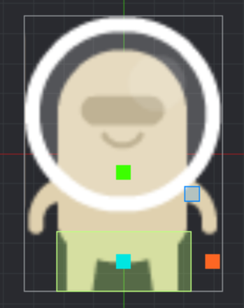

# Skapa en spelare

### Skapa spelarobjektet med script

1.  Skapa en mapp objects som ska ha era Game Objects och deras scripts i sig

2.  I mappen, skapa ett Game Objects: spelare

3.  Skapa även ett spelare.script i samma mapp

###  Lägg till spelarbilden i b.atlas (i mappen /grafik) och skapa en sprite

4\. Gå till b.atlas i grafik-mappen

5\. I Outline högerklicka på Atlas och välj “Add Images”  
  
  
6. Om ni inte lagt upp en egen bild i /grafik/bilder sök på “alien” och välj en alien med kul färg.

7\. Nu ska er atlas se ut såhär

8\. Nu välj spelare.go i /objects och högerklicka på Game Objects, välj Add Component och skapa en ny sprite. Sett dess Image till b.atlas och dess DefaultAnimation till bilden ni la in ovan

### Lägg till collisionobjects

9\. Lägg till ett collisionobject

10\. Sätt typen till Kinematic

11\. Sätt grupp till **spelare**

12\. Sätt mask till **geometri  
**- **viktigt**: ‘geometri’ är fördefinierat i fysik.script

13\. Lägg till en box-shape till din collisionobject

14\. Placera boxen vid spritens fötter

### Lägg till alla scripts som behövs

15\. Gör följande för:  
spelare.script

fysik.script

sensor.script

15.1 Välj Add Component File

15.2 Välj scriptet

### Lägg in spelaren i start.collection i /main - mappen

