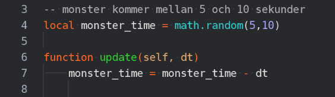

## Skapa fiende

Skapa fiendeobjektet, lägg på sprite och collisionobject

Sätt group till ‘fiende’ och mask till ‘spelare,geometri’

Fäst fysik-scriptet på fiendeobjektet. Sätt type till ‘kinematic’.

Skapa fiende.script och fäst det på fiendeobjektet, i fiende.script, skriv update-funktionen och gör så att fienden rör sig åt vänster

i fabrik.script, lägg till en variabel monster time som kollar om ett monster ska komma. I update, minska monster time med dt.

Efter att vi skapat en plattform, kolla om det är dags att skapa ett monster

Lägg till fienden på plattformen och spelarens kollisionsobjekt

Uppdatera on_message i spelare-scriptet så att spelaren dör om man nuddar ett monster

(detta kan senare bytas ut mot att vi laddar gameover.collection eller startar om spelet)
