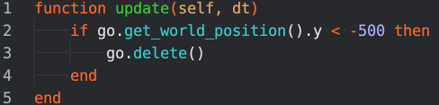
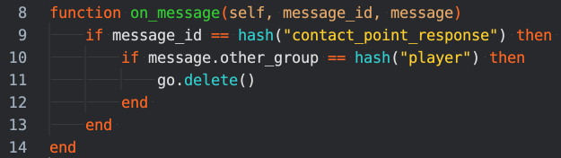
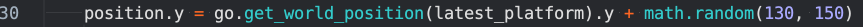
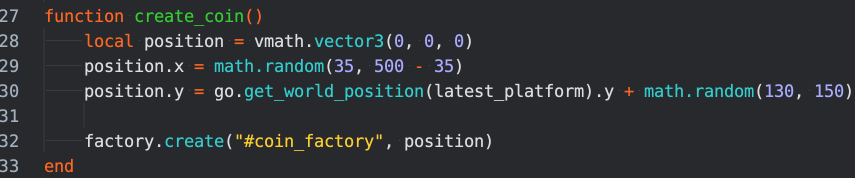
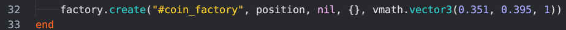
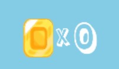
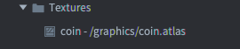
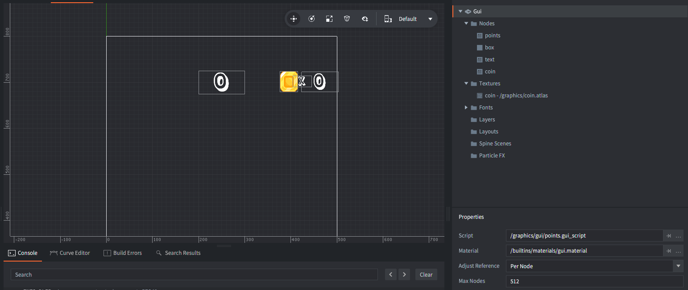
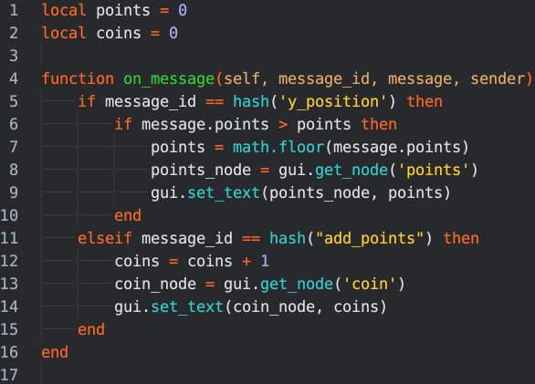
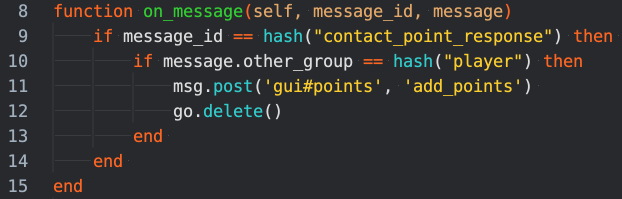

# Skapa mynt

<u>Nivå</u>: Deltagare ska ha gått Defold 3 (Spelstudio By King)

Vad bra att du har kommit såhär långt. Nu ska vi skapa lite mynt som gör spelet lite mer interaktivt.

### Genomförande

<table><thead><tr class="header"><th><ul><li><blockquote>
Vi har redan fixat så att det finns massor utav bilder på mynt som roterar. Du finner dom i <strong>graphics</strong> coin.atlas
</blockquote></li><li><blockquote>
Men nu ska vi skapa själva objekten som behövs.
</blockquote><ul><li><blockquote>
Börja med att skapa en mapp i object mappen namnge mappen: <strong>coin</strong> i mappen ska det finns två saker: coin.go och coin.script
</blockquote></li></ul></li></ul><h2 id="myntet">Myntet</h2><h4 id="coin.go">coin.go</h4><ul><li><blockquote>
Lägg till scriptet i game objectet
</blockquote></li><li><blockquote>
Lägg till en sprite
</blockquote><ul><li><blockquote>
Lägg till coin.atlas
</blockquote><ul><li><blockquote>
Välj coins animationen
</blockquote></li></ul></li></ul></li><li><blockquote>
Skapa ett kollisions object
</blockquote><ul><li><blockquote>
Lägg till en form på den, välj formen <strong>box</strong> och skala den så att den passar in på objektet
</blockquote></li><li><blockquote>
Ändra på mask och group
</blockquote><ul><li><blockquote>
Group: coin
</blockquote></li><li><blockquote>
Mask: player
</blockquote></li></ul></li></ul></li></ul><h4 id="coin.script">coin.script</h4><ul><li><blockquote>
När vi har våra mynt så vill vi att dom ska raderas när dom inte längre kan plockas upp av oss.
</blockquote></li><li><blockquote>
Börja med att plocka bort alla funktioner förutom <strong>function update()</strong> och <strong>function on_message()</strong>
</blockquote><ul><li><blockquote>
i vår update vill vi kolla om myntet har ändrat på sin y position tillräckligt för att raderas. Vi får kolla om y position är mer än -500.
</blockquote></li></ul></li></ul><blockquote>

</blockquote><ul><li><blockquote>
Okej nu raderas våra mynt när dom kommer till en viss position. Men inget händer om vi kolliderar med dom.
</blockquote><ul><li><blockquote>
i <strong>on_message</strong> kan vi kolla om vi kolliderar med något, i detta fall vill vi att om vi kolliderar med spelaren raderas och skapa poäng. (vi kommer till poängen senare)
</blockquote></li><li><blockquote>
Börja med att kolla efter en kollision
</blockquote><ul><li><blockquote>
Sedan kolla vad vi kollar med och jämför med vad vi vill kollidera med. alltså <strong>player</strong>
</blockquote><ul><li><blockquote>
hint. Du jämför kollisions gruppen mellan 2 objekt med <strong>message.other_group</strong>
</blockquote></li><li><blockquote>
Sedan är det bara att radera myntet för tillfället.
</blockquote></li></ul></li><li><blockquote>

</blockquote></li></ul></li></ul></li><li><blockquote>
Testa att starta spelet, inga mynt dyker upp….
</blockquote></li></ul><h4 id="factory.script">factory.script </h4>
Skapa en ny funktion och namnge den create_coin()
<ul><li><blockquote>
Vi måste hämta positionen till vår fabrik att skapa mynten på.
</blockquote><ul><li><blockquote>
skapa en lokal variabel fö positionen i funktionen
</blockquote><ul><li><blockquote>
vi använder oss utav vmath.vector3(0, 0, 0) som innehåll i variabeln
</blockquote></li></ul></li><li><blockquote>
Vi måste även kolla på dom olika koordinataxlarna x, y och z.
</blockquote><ul><li><blockquote>
Eftersom att vi utvecklar ett 2D spel så behöver vi inte riktigt tänka på z axeln så mycket men x och y är våra viktigaste komponenter.
</blockquote></li></ul></li><li><blockquote>
hämta positionen av x axeln och säg att den är random mellan 35, 500 - 35
</blockquote><ul><li><blockquote>
math.random(35, 500 - 35)
</blockquote></li></ul></li><li><blockquote>
hämta också y positionen och säg att vi vill ha den vid latest_platforms y pos och att vi kör en random mellan 130, 150
</blockquote><ul><li><blockquote>

</blockquote></li></ul></li><li><blockquote>
Nu ska vi skapa våra mynt.
</blockquote><ul><li><blockquote>
lägg till en factory.create() i den kommer vi skriva dom parametrana som saknas.
</blockquote></li><li><blockquote>
<strong>factory.create(url, [position], [rotation], [properties], [scale])</strong>
</blockquote></li><li><blockquote>
Vi har inte skapat vår fabrik ännu, men den kommer att heta <strong>coin_factory</strong>
</blockquote></li><li><blockquote>
Nu ska vi ange vår position, skriv in variabel namnet för positionen som den andra parametern.
</blockquote></li><li><blockquote>
Det räcker nu för tillfället.
</blockquote></li></ul></li></ul></li></ul><ul><li><blockquote>
Nu är vi nästan klara
</blockquote></li></ul><h4 id="factory.go">factory.go</h4><ul><li><blockquote>
Lägg till en fabrik i game objektet.
</blockquote><ul><li><blockquote>
Id:et på fabriken ska vara <strong>coin_factory</strong>
</blockquote></li></ul></li></ul>
Testa nu att starta spelet….

Vilka gigantiska mynt. Vi får ändra lite i vår kod för att ändra på skalan.

öppna factory.script igen. Gå ner till vår factory.create() där ska vi skriva lite till.

Vi måste lägga till skala, den är den 5:e parametern i factory create så vi säger att den ska ha. Först säger vi att vår rotations ska vara nil
<ul><li><blockquote>
Odentifierat tal eller saknar värde.
</blockquote></li></ul>
sedan säger vi att vi har en table
<ul><li><blockquote>
.
</blockquote></li></ul>
Nu skalan, du ändrar på den via att berätta vilka 3 axlar som ska ändras.

skriv då vmath.vector3(x, y, z) kolla bilden ovan så finner du siffrorna som du ska använda.
<h2 id="gui">GUI</h2>
Vi ska nu skapa GUI som har med myntet att göra. När vi är klara ska vi kunna få poäng kolla bilden

<h4 id="points.gui">points.gui</h4>
Nu är det dags att skapa lite synlig text på skärmen så att vi vet hur många mynt vi har samlat.

Börja med att öppna guin där ‘ven våra poäng för höjden vi har kommit finns.

Lägg till en textur, du gör det genom att högertrycka på Textur mappen och välja en atlas. I detta fall så ska vi använda oss utav <strong>coin.atlas</strong>

För att vi ska kunna ha den i vårt spel och även att den ska kunna rotera så väljer vi att lägga till en nod
<ul><li><blockquote>
Högerklicka på Nodes
</blockquote><ul><li><blockquote>
välj först en box
</blockquote><ul><li><blockquote>
Den är till för vårt mynt.
</blockquote><ul><li><blockquote>
Flytta den nu till en bra position, vår ligger på X:396 Y: 702 Z: 0
</blockquote></li></ul></li><li><blockquote>
sätt en bra skala på den så att den får plats på skärmen och inte tar alldeles för mycket plats.
</blockquote></li></ul></li><li><blockquote>
Välj en text nod
</blockquote><ul><li><blockquote>
Denna är till för att visa “X” mellan bilden och våra coins.
</blockquote><ul><li><blockquote>
välj fonten som redan är inlaggd, kalas.
</blockquote></li><li><blockquote>
Skriv “X” i text rutan
</blockquote></li><li><blockquote>
Placera den bra, ex på position: X: 425 Y: 702 Z:0
</blockquote></li></ul></li></ul></li><li><blockquote>
Välj nu en till text nod
</blockquote><ul><li><blockquote>
Detta ska vara våran nod för att kunna räkna mynten.
</blockquote></li><li><blockquote>
ge den id:et - <strong>coin</strong>
</blockquote></li><li><blockquote>
och sätt texten till 0 med en font.
</blockquote></li></ul></li></ul></li><li><blockquote>
Nu är vi klara i points.gui det borde se likande ut till denna:
</blockquote></li><li><blockquote>

</blockquote></li></ul><h4 id="points.gui_script">points.gui_script</h4>
Nu ska vi skriva vår kod för att kunna få våra poäng.

Börja med att öppna points.gui_scriptet, där finner vi koden för själva nuvarande poängen och nu vill vi lägga till så att vi ändrar på coin noden.
<ul><li><blockquote>
Skapa en variablen som heter <strong>coins</strong> och ge den värdet 0 (coins = 0)
</blockquote></li><li><blockquote>
nu ska vi skapa en elseif sats för att kolla om meddelandet inte är “y_position” och istället “add_points”
</blockquote><ul><li><blockquote>
Vi kollar då om meddelandet är add points då ska vi lägga till ett mynt i vår variabel
</blockquote><ul><li><blockquote>
säg nu att coins är en mer än innan
</blockquote><ul><li><blockquote>
coins = coins + 1
</blockquote></li></ul></li><li><blockquote>
sedan måste vi hämta vår nod som vi ska visar sig.
</blockquote><ul><li><blockquote>
vi skrover därför att coin_node = gui.get_node(‘coin’) - OBS viktigt att denna stämmer överns med idet vi gav i points.gui annars kommer det inte att fungera.
</blockquote></li></ul></li><li><blockquote>
Det som är kvar att göra då är att sätta till den nya texten. Genom att använda gui.set_text(node, variabel) - OBS är endast exempel byt ut till rätt info
</blockquote><ul><li><blockquote>
kolla bilden så att det stämmer
</blockquote></li></ul></li><li><blockquote>

</blockquote></li></ul></li></ul></li></ul><ul><li><blockquote>
Testa starta spelet, fungerar det?.....
</blockquote><ul><li><blockquote>
Vad kan vi ha glömt för något??
</blockquote></li></ul></li></ul><ul><li><blockquote>
Juste den får aldrig något meddelande om att lägga till points, öppna coin scriptet och skicka ett meddelande till vår GUI
</blockquote><ul><li><blockquote>

</blockquote></li><li><blockquote>
function on message borde se ut såhär.
</blockquote></li></ul></li><li><blockquote>
Testa nu, fungerar det!
</blockquote></li></ul>
Ja! Bra jobbat! :) Det finns fler uppgifter som väntar, gör dom också och spelet kommer bli så coolt!
</th></tr></thead><tbody><tr class="odd"><td></td></tr></tbody></table>

### Tips och trix

### Bilagor

-   Här finns en API med alla olika funktioner som spåret använder

    -   [<u>Defold/Lua API</u>](https://docs.google.com/document/d/1wNVHVbsEygRJ8ERMSRVUesvpo4vXKPuyI4MQwbsIepc/edit#heading=h.76i2mcbfv8w4)

### 
